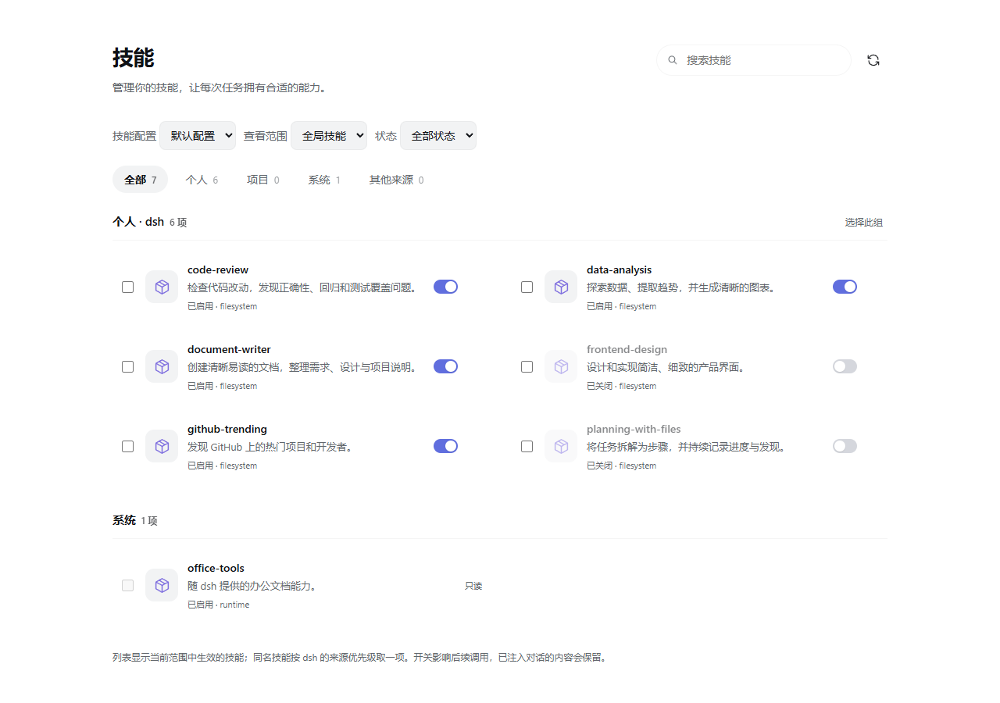

# dsh-skills-manager

[](https://github.com/asdnmy123/dsh-skills-manager/actions/workflows/ci.yml)
[](https://deepseek-harness.github.io/deepseek-harness/)

**为 DeepSeek Harness 桌面端添加「技能」管理页面，支持搜索、选择、启用、关闭和删除技能。**



## 功能

- 搜索技能，按来源、状态、工作区和技能配置（preset）筛选。
- 单项或批量启用、关闭、删除，每次最多 100 项。
- 关闭后仍可查看和重新启用，并恢复原有调用策略。
- 删除前确认，技能文件及资源移入回收目录，可手动恢复。
- 支持浅色、深色主题和窄屏布局。

## 安装

使用桌面端自带的 `dsh` 命令，一条指令安装，无需克隆仓库、构建或编辑配置：

```powershell
dsh plugin --profile desktop add github:asdnmy123/dsh-skills-manager#v0.1.2
```

安装后重启 DSH，在左侧打开「技能」。

也可以在桌面端的「插件」页面使用同一个安装地址：

```text
github:asdnmy123/dsh-skills-manager#v0.1.2
```

如果命令提示 Desktop profile 只能由 Electron 管理，请改用桌面端提供的 CLI 或上面的插件页面；单独安装的 npm CLI 不负责管理 Desktop profile。

| 安装方式 | 地址 |
| --- | --- |
| 固定版本（推荐） | `github:asdnmy123/dsh-skills-manager#v0.1.2` |
| 跟随 main | `github:asdnmy123/dsh-skills-manager` |
| 离线安装 | [下载 Release 安装包](https://github.com/asdnmy123/dsh-skills-manager/releases/latest)，在插件页选择 `.tgz` 文件 |

仓库已包含构建产物，GitHub 安装不运行构建脚本。当前按 **DSH Desktop 0.2.0-rc.2** 开发和验证。

## 使用

1. 默认读取当前默认 preset 的技能；通过「技能配置」切换查看其他 preset 或宿主全局。这个选择只影响管理页面。
2. 选择「查看范围」中的工作区，可同时查看项目技能。
3. 点击开关启用或关闭技能；勾选后可进行批量操作。
4. 删除按钮在技能行悬停或获得键盘焦点时显示，确认后移入回收目录。

开关影响后续调用，已注入对话的内容会保留。列表显示当前范围中生效的同名优胜项；删除后可能出现较低优先级的同名技能。

## 管理范围与恢复

支持个人 `.dsh/skills`、`.agents/skills`、工作区内的项目技能，以及明确配置的自定义目录。

随包、远程、虚拟或链接技能等会显示「只读」，悬停可查看原因。状态保存到原技能文件，共享同一文件的宿主会读取同一调用策略。

删除的技能保存在原技能根目录的 `.dsh-skills-manager-trash/<编号>/` 下。打开其中的 `receipt.json`，将技能文件或目录移回 `originalPath`，然后刷新页面。原位置已有内容时，先处理名称冲突。

[目录与自定义配置、状态保存、恢复说明](docs/advanced.md)

## 卸载

```powershell
dsh plugin --profile desktop remove dsh-skills-manager
```

也可以在桌面端「插件」页面卸载。卸载插件不会自动恢复已关闭或已删除的技能。

## 开发

```sh
npm ci
npm run build
npm run verify
```

需要 Node.js 22.12 或更高版本。完整验证包含类型检查、构建产物一致性、业务与客户端集成测试、真实浏览器测试和打包检查。

[开发与验证说明](docs/development.md) · [更新记录](CHANGELOG.md) · [反馈问题](https://github.com/asdnmy123/dsh-skills-manager/issues)

## 许可证

暂未指定开源许可证（UNLICENSED）。
